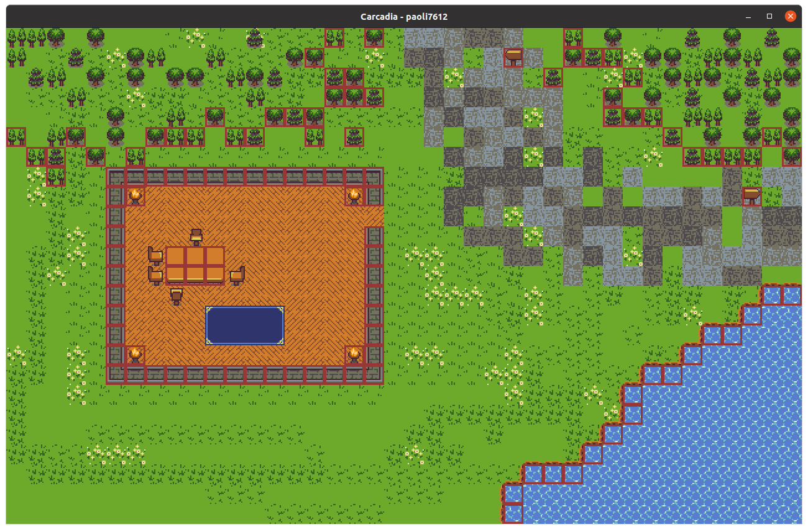

# Carcadia

- *bin*
- *fonts*
- *img*
- *include*
- *maps*
- *src*
- *tests*

# tile non-walkable (se si puo dire cosi) 

<video width="320" height="240" controls>
  <source src="doc/v01.mkv" type="video/mkv">
</video>